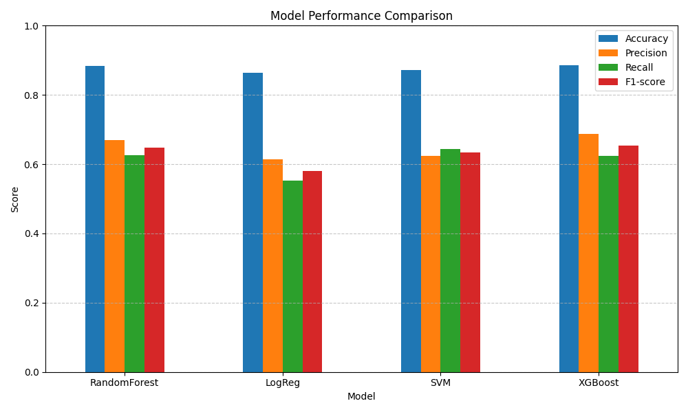

# 💤 MMASH Sleep Detector

## 🎯 Objective

Build a sleep detection model using multimodal data: heart rate (RR), movement (actigraphy), and sleep annotations.

## 🧠 What it does

* Preprocesses raw RR and actigraphy signals.
* Extracts windowed statistical features.
* Labels sleep intervals using `sleep.csv`.
* Trains a classifier to predict sleep windows.
* Evaluates and visualizes model performance.

## 🗂️ Project Structure

```
├── data/
│   ├── raw/             # Original MMASH files (not committed)
│   ├── processed/       # Merged per-user data
│   └── features/        # Extracted feature windows with labels
├── notebooks/           # EDA, model training, evaluation
├── reports/
│   └── figures/         # Generated plots for README & reports
├── src/
│   └── data/            # Preprocessing and loading logic
├── prepare_all.py       # Run full pipeline
├── main.py              # Entry point for model training/testing
├── requirements.txt     # Python deps
└── Makefile             # Run clean/train/eval commands
```

## 🚀 Getting Started

```bash
python3 -m venv .venv
source .venv/bin/activate
pip install -r requirements.txt
```

## 🧰 Usage

```bash
make prepare     # Preprocess and generate features
make train       # Train model on all users
make eval        # Evaluate model
```

## 📊 Results Preview



## 📎 Notes

* Raw data excluded from git (`data/raw/`).
* Processed and feature data auto-generated.

## 🤝 Acknowledgements

Data from [MMASH dataset](https://physionet.org/content/mmash/1.0.0/)

## 📬 Contact

Noé Cornu • [noe.cornu@epita.fr](mailto:noe.cornu@epita.fr) • [GitHub](https://github.com/noecrm)
